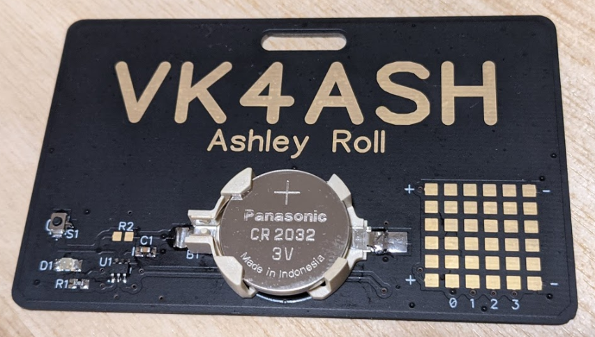
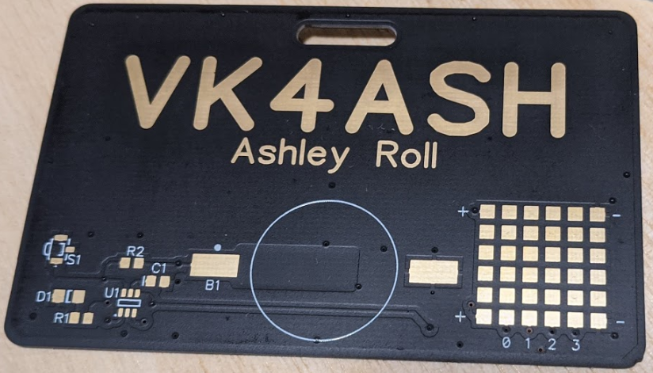

# Call Sign Morse Code Badge

This project is my wearable call sign badge. Its a PCB with my name and call
sign, with a small micro-controller that will send my call sign as Morse on an
LED.

The badge remains powered constantly, but the micro-controller is in a low power
state drawing a very tiny current (somewhere in the region of 10-20uA) so the
CR2032 cell will last a long time in standby.

When initially powered up, or when the reset button is pressed, the
micro-controller will send out the programmed Morse Code message at about 10
words per minute. It will repeat the message, with a small delay between, five
times, then go back to sleep.

## Hardware

The hardware schematic and PCB are designed in
[Diptrace](https://diptrace.com/), there is a free version available.

The design centres around a *PIC10LF322*, an 8-bit micro-controller from
Microchip. I use the 6 pin variant in an SOT-23-6 package. This is powered by a
CR2032 cell in a holder and has a minimum of additional components to flash the
LED.

There is a reset switch (to restart the sending sequence once it goes to sleep)
and a programming port on the back to allow the firmware to be updated.

I've also added a small prototyping section with all signals accessible for
hacking on additional circuits if desired.

On the back of the PCB is a series of pads that match the standard PicKit3
programming cable ordering. I have a set of pogo-pins soldered to 0.1" vero
board that seat on the pads for programming.

There is a slot for a badge clip, and a pad on the back where a small brass
tube could be soldered for a safety pin to clip the badge to your shirt.

## Firmware

This is a simple `Makefile` based assembly language project. I've implemented
it on Linux using the Microchip XC8 MPASM assembler.

The `Makefile` will need to be updated to point to the correct installation
locations for XC8 and MPLABX. (I used the MPLABX installation to drive my
PicKit3 for programming only, so it can be skipped).

The firmware will send a Morse code message (for instance a call sign)
repeatedly several time, then it will go back to sleep until the reset button
is pressed.

While sending the Morse code, the micro-controller will be asleep as much as
possible as well.

Ashley Roll. VK4ASH. 2020-04-11
